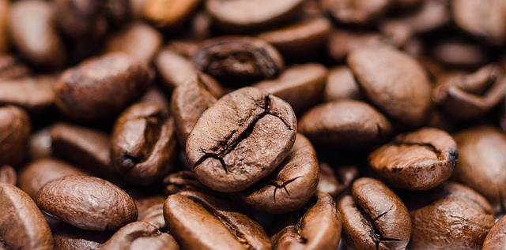

I love the narratives with great origin stories, and now I have decided to dedicate my time to chronicle my journey into the rabbit hole called "Brewed Coffee”, hence I am obliged to include the origin story of this coffee affair

The timeless verse of the Chef Ranveer Brar 🙏 "Ye v India ki nhi hai" holds true for Coffee also. However for coffee we at least know Baba Budan is to be thanked for blessing us with the joy of brewed delicacy.

Oh, and here's a short note from Wikipedia on
[Coffee Production in India](https://en.wikipedia.org/wiki/Coffee_production_in_India).

> In the Indian context, coffee growing started with an Indian Muslim saint, Baba Budan,[2][8] who, while returning from a pilgrimage to Mecca, smuggled seven coffee beans (by hiding them in his beard) from Yemen to Mysore in India.[7] He planted them on the Chandra Drona Giri (1,829 metres (6,001 ft))('Giri' means "hill") in Chikkamagaluru district. It was considered an illegal act to take out green coffee seed out of Arabia. As number seven is a sacrosanct number in Islamic religion, the saint's act of carrying seven coffee beans was considered a religious act

   

A religious act indeed !!! my wallet could never afford imported Ethiopian Yirgacheffe had he not smuggled the seven little beans of joy.   

Enough on the origins of coffee in India now it is time to delve into why I willingly put so much effort into perfecting this psychoactive brew.   

Well on a fine Winter afternoon a couple of years back I was strolling across the isles of a retail store when I came across a black packet of freshly put instant Coffee, I was reading through the back label when I saw the magical lines "Research has shown coffee reduces the risk of Alzheimer's disease". I was shell shocked; the disease I dread most, the Voldemort of the diseases and I can reduce the risk with just a cup of coffee. Why not??    

I instantly purchased the pack of instant coffee. I had tasted coffee earlier, however all those earlier instances involved copious amount of sugar in a cup of milk and cautious addition of half a spoon of coffee to ensure the concoction never ever turns bitter. No playing around with the amount of sugar at all.     

There is no fooling around the fact the more I am aging quirkier I am becoming. At the point when I decided to try black coffee I had already decided to reduce the amount of crystal sugar and my divorce with milk in its pure liquid form was already formalized. Hence I did what I could I dissolved a spoon of that brown instant coffee into hot unsweetened water. I knew the stuff would not taste great but never knew it would be stuff of nightmares !!!   

Over the period I tried to vary the ratio of that bitter brown powder and the hot water and even the temperature of the water, frankly nothing worked. To put it politely may be I am over sensitive to the bitter taste. I had decided to call quits on coffee when Youtube recommended a video of his holiness 🙏 Shree Shree 108 the Barista of Baristas Mr James Hoffman. He was describing brewed coffee as sweet. I thought maybe this instant coffee is the "goldana chai" scam of the coffee world, maybe I need the brewed coffee. And friend that is "How I met brewed coffee". The decision to pursue the brewed coffee took me down the rabbit hole which finally materialized into this tell all series. I hope some of the future blogs will have some stuff which may help you with your own journey.
